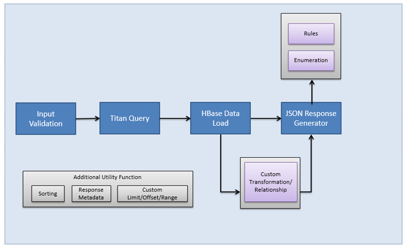
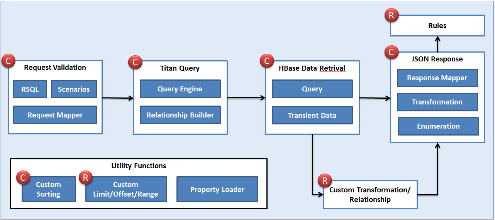
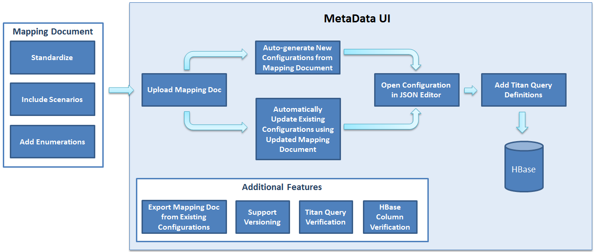

# Overview

This is the documentation for API Framework which provides effective way of creating API using JSON Configurations.

!!! note
    The Microservices Framework is still under development and new features are getting added on a daily basis. Please refer the **release note** section for updated information.  

## Typical API Development Process

* Typically there are 4 major steps in any type of API Development (Assuming TitanDB/Solr used for Search and HBase to retrieve the data)
    * Input Validation
    * Titan/Solr query
    * HBase Data Retrieval
    * JSON/XML Response Generator

* The API Framework provides ability to use reusable components driven by configurations.

### Currently Supported Components

* The following components are currently supported and can be created using JSON Configurations.

## End to End API Automation Workflow using the Framework

* The Framework not only allows us to use the components using configurations, but also provides an opportunity to even automate the creation of the configurations from the mapping doc itself.
* There will be functionality added in the current metadata ui application to allow users to upload a mapping doc and generate the related configurations from the mapping doc.
    * User will be able to create the configuration using guided wigets.
* The Metadata UI will also provide functionality to validate the titan query (Real-time).
* Versioning will also be enabled.     
* Once the configuration has been created, it will be stored in HBase and can be used by the Framework to provide the required functionality.

## Advantages
* This will greatly reduce the development effort and increase efficiency by re-using the common components.
* Anyone without extensive system knowledge will be able to modify/create new APIs.
* Supports scenario based iterative development.
* Easy to change/update exiting logic without even opening code.
* More advanced features and supports for additional database / service / format can be added easily.    
