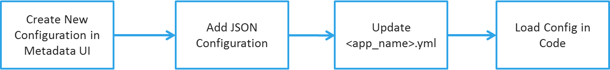
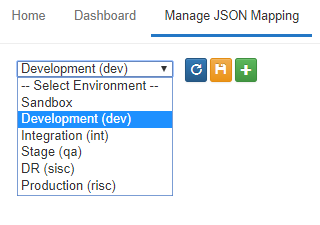
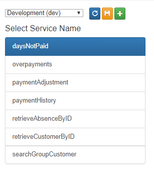
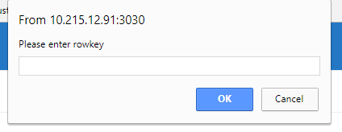
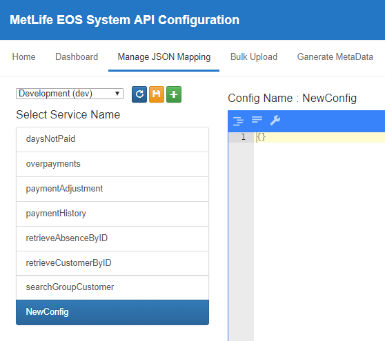
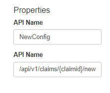

#API Setup Guide

!!! abstract
    This will demonstrate the high level setup instructions. 

##Steps



## Create New Configuration in Metadata UI
* Create a configuration in the `Metadata UI` -> `http://10.215.12.91:3030/#` (port number may vary)
* Run the `Metadata UI` -> Click on the `Manage JSON mapping` tab
* Select the environment where you want to create the configuration.
    
* Click on Refresh  to load the current configuration list.
    
* Click on the `+` to create new configurations
    * Enter the name of the configuration. This will also be the rowkey in HBase, hence this needs to be unique.
    * Click on `OK` to create config.
    
    
    
    * A new configuration will be added with empty JSON.
    
    
    
    * Additional additional fields such as API Name, URI etc.
    
    
    
    * Click on the save icon  to save the configuration to HBase.

## Add JSON Configuration

!!! danger
    Currently different version of the configuration is only maintained at HBase end, hence refresh to reload the configuration before saving your changes in order to avoid overwrite issues.  

* At this point you have an empty configuration created.
* Please add the required JSON in the JSON Editor and click on Save again.
* In the Configuration we have four sections 
    - `requestparam_Validation` - Input Validation
    -  `Titan` - Titan Query
    -  `tables` - HBase Table Configuration
    -  `response` - Create JSON response


* Here is a sample JSON ( Detailed explanation has been provided later ).

``` json
{
  "requestparam_Validation": {
    "default": {
      "parameters": [
        {
          "name": "claimNumber",
          "operator": "==",
          "required": "Yes"
        }
      ],
      "control": [
        {
          "limit": "20",
          "offset": "0",
          "sort": ""
        }
      ]
    }
  },
  "Titan": {
    "request": {
      "default": [
        {
          "query": {
            "queryName": "claimPayment",
            "claimPayment": [
              {
                "ops": "has",
                "attr": "Claim_Number",
                "value": "#claimNumber#"
              },
              {
                "ops": "hasLabel",
                "value": "Claim"
              },
              {
                "ops": "out",
                "attr": "has_a_Payment"
              },
              {
                "ops": "valueMap",
                "attr": "vid"
              }
            ]
          },
          "response": {}
        }
      ]
    }
  },
  "tables": {
    "T_CLM_PY": {
      "queryName": "claimPayment",
      "columns": [
        "b.N_PY_PERIODS"
      ]
    }
  },
  "response": [
    {
      "type": "array",
      "field": "items",
      "tableName": "CLAIM_PAYMENT",
      "columnName": "DAYS_NOT_PAID",
      "injectTableName": "PAYMENTS",
      "children": [
        {
          "type": "custom",
          "field": "self",
          "methodName": "getDaysNotPaid_Self"
        },
        {
          "type": "generic",
          "field": "number",
          "tableName": "PAYMENTS",
          "columnName": "NUMBER",
          "dtype": "string"
        },
        {
          "field": "excludeReasonCode",
          "tableName": "PAYMENTS",
          "columnName": "N_PYBL_DAY_CD",
          "type": "generic",
          "dtype": "string"
        },
        {
          "field": "excludeStartDate",
          "tableName": "PAYMENTS",
          "columnName": "STRT_DT",
          "type": "generic",
          "dtype": "string"
        },
        {
          "field": "excludeEndDate",
          "tableName": "PAYMENTS",
          "columnName": "END_DT",
          "type": "generic",
          "dtype": "string"
        }
      ]
    }
  ]
}
```

## Update `<appname>.yml` file
* Next we need to add the rowkey to the **`<appname>.yml`** file so that the JSON Configuration can be loaded during server startup.
* In the following example, total 4 rowkeys were added. 
* Multiple rowkey can be added using comma (,) separator.

``` yaml        
newmapping: paymentAdjustment,overpayments,daysNotPaid,retrieveAbsenceByID
```         

!!! info
    * Above `claimservice.yml` was updated inside the eos-config-services project.
 
## Load Config in Code
* To access the loaded configuration in Java code, use the following code 

``` java
class <BusinessLayer>
    @Autowired
    EntityMetadataConfig metadataConfig;
    
    public ResponseEntity<String> get<Function>(Map<String, String> requestParams){
    
        Map jsonConfig=metadataConfig.getMappingMetaData().get("add rowkey here");
        
        ...
        
     }
```
* Now the above `jsonConfig` can be used in different components of the code.


