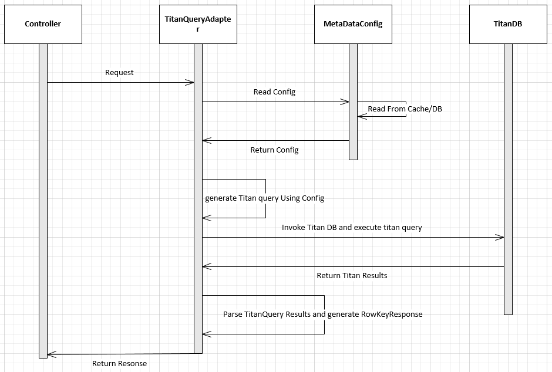

# Titan Query Adapter

!!! abstract
    TitanQueryAdapter can be used to connect to the Titan graph data base in order to get the `rowkey(s)` or `vid(s)` based on the traversal. This Adapter will return the list of RowKeys based on the titan query. The HBase Data Load component then can use the `rowkey(s)` to query HBase to get the actual entity details and to populate in service response.


## Overview
- The `titan_query` section needs to be added in the JSON Configuration.
- TitanQueryAdapter reads the configuration and generates the query.- 
- TitanQueryAdapter will execute dynamically generated query and return the RowKeys for each table

## Supported Features

|Feature Name | Sub Feature name
|------------ |-------------
|Titan Functions |<ul><li>Has</li><li>HasLabel</li><li>Out</li><li> As</li><li> OrderBy</li><li> Range</li><li> Limit</li><li> ValueMap</li><li> In</li><li> Both</li><li> Select</li><li> By</li><li> IndexQuery</li></ul>
|Multiple Scenarios | NA
|Index Query |<ul><li>MixedIndex</li><li>Composite Index</li></ul>
|Wild Char Search | <ul><li>Single Parameter</li><li> Multiple Parameter</li></ul>
|Exception Handling | NA

## Request Details
|Request Parameter |Request Type|Request Fields
|----------------- |------------|--------------
|apiFrameworkRequest|EOSAPIFrameworkRequest|<ul><li>titanQueryType</li><li>requestParamMap</li></ul>

## Response Details
|Response Parameter |Response Type|Response Fields
|----------------- |------------|--------------
|apiFrameworkResponse|EOSAPIFrameworkResponse|<ul><li>flatGraphRowKeyMap</li><li>mapKeys</li></ul>

## Pre requisites(Entry Condition)

- Request parameters needs to be validated and converted to RequestParamMap<Key value> before calling TitanQueryAdapter
- RSQL string should be validated and converted to RequestParamMap<Key value> before calling TitanQueryAdapter
- Scenario name should be passed to TitanQueryAdapter. This is main key to pick the Titan query map from the configuration

## TitanQueryAdapter Sequance diagram



## Basic Structure
- Below is the sample configuration for simple titan query

```json
"Titan": {
    "request": {
      "default": [
        {
          "query": {
            "queryName": "claimPayment",
            "claimPayment": [
              {
                "ops": "has",
                "attr": "Claim_Number",
                "value": "#claimNumber#"
              },
              {
                "ops": "hasLabel",
                "value": "Claim"
              },
              {
                "ops": "out",
                "attr": "has_a_Payment"
              },
              {
                "ops": "valueMap",
                "attr": "vid"
              }
            ]
          },
          "response": {}
        }
      ]
    }
}
```

??? example "Complex example (Skip if not required)"

    ```json
    "tian_query": {
        "request": {
          "selectQuery": [
            {
              "query": {
                "queryName": "absenceRequest",
                "absenceRequest": [
                  {
                    "ops": "hasLabel",
                    "attr": "AbsenceRequest"
                  },
                  {
                    "ops": "has",
                    "attr": "Absence_Number_Code",
                    "value": "#claimNumber#"
                  },
                  {
                    "ops": "as",
                    "attr": "AbsenceRequest"
                  },
                  {
                    "ops": "in",
                    "attr": "has_a_AbsenceRequest"
                  },
                  {
                    "ops": "as",
                    "attr": "Member"
                  },
                  {
                    "ops": "out",
                    "attr": "has_Contact"
                  },
                  {
                    "ops": "as",
                    "attr": "ContactMethod"
                  },
                  {
                    "ops": "select",
                    "attr": "Member"
                  },
                  {
                    "ops": "in",
                    "attr": "has_a_Member"
                  },
                  {
                    "ops": "hasLabel",
                    "attr": "GroupCustomer"
                  },
                  {
                    "ops": "out",
                    "attr": "is_another"
                  },
                  {
                    "ops": "as",
                    "attr": "Customer"
                  },
                  {
                    "ops": "select",
                    "attr": "AbsenceRequest,Member,ContactMethod,Customer"
                  },
                  {
                    "ops": "by",
                    "attr": "vid"
                  },
                  {
                    "ops": "dedup"
                  }
                ]
              },
              "response": {}
            }
          ]
        }
      }

    ```

- Below is the sample code snippet to invoke titanQueryAdapter from controller/business deligater.

```java
EOSAPIFrameworkResponse eosapiFrameworkResponse =  
    eosAPIFramework.titanQueryAdapter
        .getTitanRowKeys(eosapiFrameworkRequest, 
            (Map)jsonConfig.get("Titan")); 
```

- TitanQueryAdapter read the configuration from cache/DB using the config map  .
- TitanQueryAdapter will convert the configuration(above) into Titan query using Gramlin api.
- TitanQueryAdapter will read the dynamic values( input query parameters ) from the EOSAPIFrameworkRequest.requestParamMap
- When ever TitanQueryAdapter encounters #<value# then it will read the corresponding value from the EOSAPIFrameworkRequest.requestParamMap.

```java
titanConnection.getGraph().traversal().V().has("Claim_Number",#claimNumber#)
					.hasLabel("Claim").out("has_a_Payment").valueMap("vid");
```


- below is the sample response TitanQueryAdapter will return back  for the above titan configuration.
```json
{
  claimPayment=[
    -1050846467411942099
  ]
}
```

??? example "Complex example (Skip if not required)"
    ```json
    {
      absenceRequest=[
        {
          TitanQueryRelationResult=[
            {
              AbsenceRequest=5942163829025099943,
              Member=-8668377820092427996,
              ContactMethod=5126035711794990839,
              Customer=1345563336256692547
            },
            {
              AbsenceRequest=5942163829025099943,
              Member=-8668377820092427996,
              ContactMethod=7197611608030668910,
              Customer=1345563336256692547
            },
            {
              AbsenceRequest=5942163829025099943,
              Member=-8668377820092427996,
              ContactMethod=-8717648880362260307,
              Customer=1345563336256692547
            }
          ],
          Customer=[
            1345563336256692547,
            1345563336256692547,
            1345563336256692547
          ],
          AbsenceRequest=[
            5942163829025099943,
            5942163829025099943,
            5942163829025099943
          ],
          ContactMethod=[
            5126035711794990839,
            7197611608030668910,
            -8717648880362260307
          ],
          Member=[
            -8668377820092427996,
            -8668377820092427996,
            -8668377820092427996
          ]
        }
      ]
    } 
    ```


## Titan Operations

### has
- This will Filters vertices, edges and vertex properties based on the existence of properties. Below are the atrributes should define in the confguration.  

|AttributeName |AttributeValue
|------------- |--------------
|ops           |has
|attr          |Titan vertex attribute name
|value         |Titan vertex attribute value 

!!! example
    ```json
      {
        "ops": "has",
        "attr": "Absence_Number_Code",
        "value": "#claimNumber#"
      }
    ```

### hasLabel
- This will Filters vertices, edges and vertex properties based on their label.This should be included when we need to query on specific vertex ( ex. GroupCustomer,Member) .Below are the atrributes should define in the confguration for hasLabel. 

|AttributeName |AttributeValue
|------------- |--------------
|ops           |hasLabel
|value         |Titan vertex label name

!!! example
    ```json
      {
        "ops": "hasLabel",
        "attr": "AbsenceRequest"
      }
    ```

### valueMap
- This will Map the Element to the values of the associated properties given the provide property keys. Below are the atrributes should define in the confguration for valueMap.

|AttributeName |AttributeValue
|------------- |--------------
|ops           |valueMap
|attr         |Titan vertex attribute name

!!! example
    ```json
      {
        "ops": "valueMap",
        "attr": "vid"
      }
    ```

### out
- This will Map the Vertex to its outgoing adjacent vertices given the edge labels. Below are the atrributes should define in the confguration for valueMap.

|AttributeName |AttributeValue
|------------- |--------------
|ops           |out
|attr         |Titan vertex attribute name

!!! example
    ```json
      {
        "ops": "out",
        "attr": "has_a_Payment"
      }
    ```

### in
- This will Map the Vertex to its incoming adjacent vertices given the edge labels. Below are the atrributes should define in the confguration for in.

|AttributeName |AttributeValue
|------------- |--------------
|ops           |in
|attr         |Titan vertex attribute name

!!! example
    ```json
      {
        "ops": "in",
        "attr": "has_a_Member"
      }
    ```

### select
- This will Map the Traverser to the object specified by the selectKey. Below are the atrributes should define in the confguration for select.

|AttributeName |AttributeValue
|------------- |--------------
|ops           |select
|attr          |Titan vertex label name

!!! example
    ```json
      {
        "ops": "select",
        "attr": "AbsenceRequest,Member,ContactMethod,Customer"
      }
    ```

### as
- A step modulator that provides a lable to the step that can be accessed later in the traversal by other steps. Below are the atrributes should define in the confguration for as.

|AttributeName |AttributeValue
|------------- |--------------
|ops           |as
|attr          |Unique reference name

!!! example
    ```json
      {
        "ops": "as",
        "attr": "AbsenceRequest"
      }
    ```

### by
- The by() can be applied to a number of different step to alter their behaviors. Below are the atrributes should define in the confguration for by.

|AttributeName |AttributeValue
|------------- |--------------
|ops           |by
|attr          |Titan vertex attribute name

!!! example
    ```json
      {
        "ops": "by",
        "attr": "vid"
      }
    ```

### dedup
- This will Remove all duplicates in the traversal stream up to this point. Below are the atrributes should define in the confguration for dedup.

|AttributeName |AttributeValue
|------------- |--------------
|ops           |dedup

!!! example
    ```json
      {
        "ops": "dedup"        
      }
    ```

### order
- This will Order all the objects in the traversal up to this point and then emit them one-by-one in their ordered sequence. Below are the atrributes should define in the confguration for order.

|AttributeName |AttributeValue
|------------- |--------------
|ops           |order
|attr          |Titan vertex attribute name

!!! example
    ```json
      {
        "ops": "order",
        "attr": "address_effective_date"
      }
    ```

### limit
- This will limit the traversal objects to the limit argument. THis will allow first n objects defined by the limit argument. Below are the atrributes should define in the confguration for limit.

|AttributeName |AttributeValue
|------------- |--------------
|ops           |limit
|value          |number

!!! example
    ```json
      {
        "ops": "limit",
        "attr": "10"
      }
    ```

### both
- This will Map the Vertex to its adjacent vertices given the edge labels.. Below are the atrributes should define in the confguration for limit.

|AttributeName |AttributeValue
|------------- |--------------
|ops           |both
|attr          |Titan vertex label name

### range
- This will Filter the objects in the traversal by the number of them to pass through the stream. Below are the atrributes should define in the confguration for range.

|AttributeName |AttributeValue
|------------- |--------------
|ops           |range
|from          |number
|to            |number

!!! example
    ```json
      {
        "ops": "range",
        "from": "3",
        "to": "10"
      }
    ```


	
	